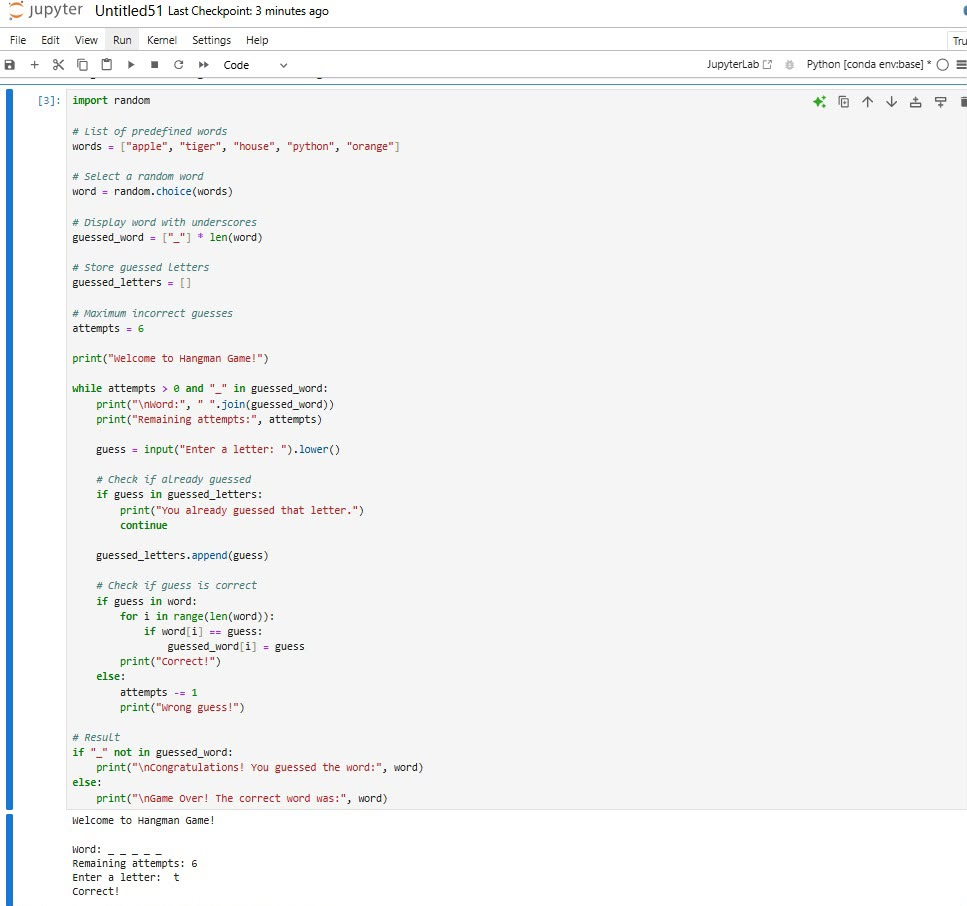

# 🎮 CodeAlpha - Hangman Game

## 📌 Project Overview

This project was developed as part of the **CodeAlpha Python Programming Internship**.

The Hangman Game is a simple text-based console application where the player guesses a hidden word one letter at a time. The game allows a maximum of six incorrect guesses before the player loses.

This project focuses on strengthening Python fundamentals including loops, conditional statements, strings, lists, and the random module.

---

## 🚀 Features

- Randomly selects a word from a predefined list
- Displays hidden letters using underscores
- Accepts one letter at a time
- Prevents duplicate guesses
- Limits incorrect guesses to 6
- Displays win or lose message

---

## 🛠 Technologies Used

- Python 3
- random module

---

## 📂 Project Structure

```
CodeAlpha_Hangman/
│
├── hangman.py
└── README.md
```

---

## ▶️ How to Run

Clone the repository

```bash
git clone https://github.com/yourusername/CodeAlpha_Hangman.git
```

Move into the project

```bash
cd CodeAlpha_Hangman
```

Run

```bash
python hangman.py
```

---

## 💻 Sample Output

```
Welcome to Hangman Game!

Word: _ _ _ _ _

Remaining Attempts: 6

Enter a letter:
```

---

## 📚 Concepts Used

- Random Module
- While Loop
- If-Else
- Strings
- Lists

---

## 🎯 Internship Task

Task 1 – Hangman Game

CodeAlpha Python Programming Internship

---
## 📸 Program Output



## 👨‍💻 Author

Varshini Ambati

B.Tech ECE student
